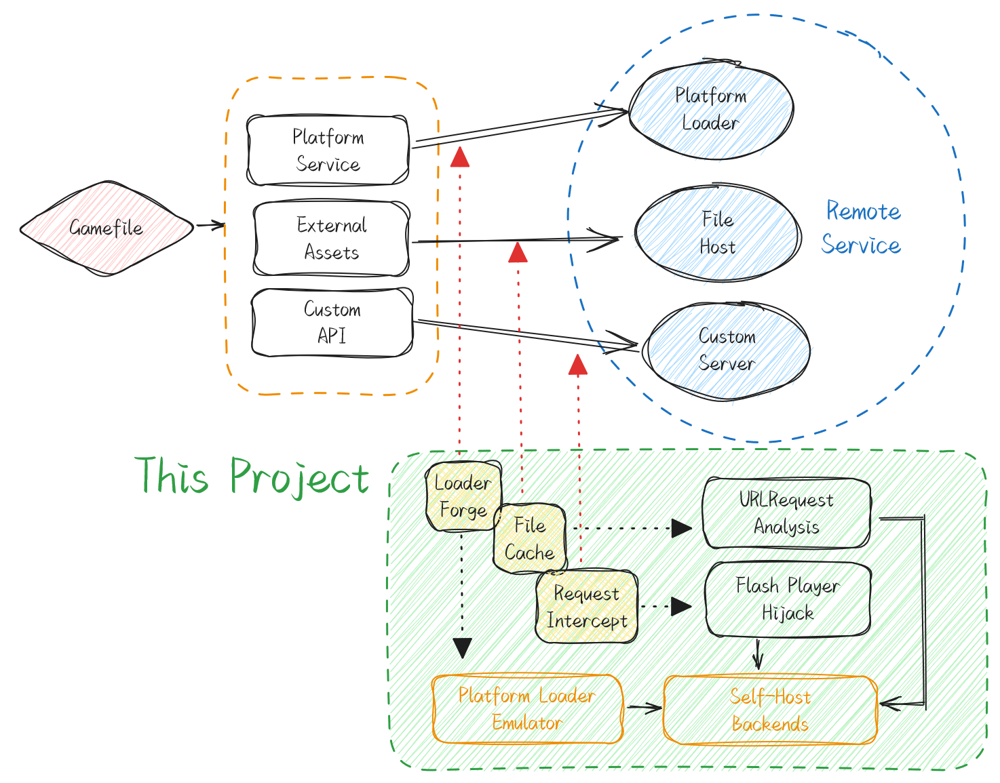

<h1 align=center>SPECULUM-4399 · 造梦西游3 离线版</h1>

> [!NOTE]
> 本项目仅满足个人学习交流，不保证任何有效性。

## 简介

让 4399《造梦西游3》在本地 Flash Player 中离线运行的加载器：

- 无需浏览器、无需登录 4399 账号
- 自动下载游戏资源并本地缓存，可完全离线游玩
- 已适配：存档系统、电卷/VIP、商店消费、邀请好友（本地双人档）
- 本地代理伪造 4399 平台接口（存档、时间同步、统计等），游戏内不出现网络报错

## 环境要求

- Python 3.10+
- JDK 11+（建议 17）与 Maven 3.6+
- Apache Flex SDK 4.16.1，`frameworks/libs/player/32.0/` 下放置 `playerglobal.swc`（32.0 版本）
- Adobe Flash Player 32 Standalone（建议使用调试版）

## 构建

1. 下载 [FFDec_lib](https://github.com/jindrapetrik/jpexs-decompiler/tree/master/libsrc/ffdec_lib)（20.1.0），将 `ffdec_lib.jar` 及其依赖放入 `swfutil/libs/`，然后构建：

    ```shell
    cd swfutil
    mvn install:install-file -Dfile=libs/ffdec_lib.jar -DgroupId=com.jpexs.decompiler -DartifactId=ffdec_lib -Dversion=20.1.0 -Dpackaging=jar
    mvn package
    ```

2. 安装 Python 依赖：

    ```shell
    pip install -r requirements.txt
    playwright install chromium
    ```

3. 参照 `.env.example` 创建 `.env`：

    ```ini
    BACKEND_PORT=8888
    FLEX_PATH=C:\\flex\\
    FLASH_PLAYER_PATH=C:\\flashplayer\\flashplayer_32_sa_debug.exe
    ```

4. 将当前目录加入 Flash Player 信任列表：

    ```shell
    echo %CD% > %APPDATA%\Macromedia\Flash Player\#Security\FlashPlayerTrust\trust.cfg
    ```

## 使用

初始化并运行《造梦西游3》：

```shell
py -3 main.py init "https://www.4399.com/flash/zmhj.htm?g=3"
py -3 main.py run
```

- 电卷/累计充值默认 50000（VIP5）。如需调整，修改 `core/speculum/loader/SpeculumLoader.as` 中的 `_balance` 后重新编译 `Main.swf`
- 双人模式：游戏中点击「邀请好友」→「切换账号」→ 选择本地存档作为 2P 角色
- 存档保存在 `out/game_save.json`，可直接拷贝携带

## 已知限制

- 联盟（工会）功能未启用：接口返回空数据，不会报错但不可用
- 排行榜、活动接口返回空数据，界面可打开但不显示内容
- 未处理的其他 4399 接口由本地代理统一吞掉，避免游戏弹出网络错误

## 协议

除 `external` 文件夹下的文件外，其余文件均采用 [AGPL-3.0 协议](LICENSE) 进行许可。

## 其他

技术细节参考[这篇博客](https://blog.itsmygo.tech/posts/play-an-4399-flash-game-offline/)。

<p align=center></p>
